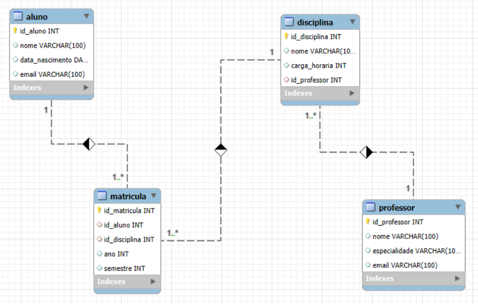

# Projeto Escola
Este projeto visa estruturar um banco de dados para um sistema escolar, abrangendo alunos, disciplinas, professores e matrículas.

# Estrutura do Banco de Dados

## Diagrama EER

## Tabelas Principais
- Aluno: Armazena informações dos alunos.
- Professor: Contém dados dos professores.
- Disciplina: Registra as disciplinas oferecidas.
- Matrícula: Associa alunos às disciplinas em que estão matriculados.
## Links para Arquivos
- [Projeto Lógico](escola.mwb)
- [Criação do Banco e das Tabelas](escola.sql)
- [Inserção dos Dados](escola_insert.sql)
- [Consultas das Tabelas](escola_select.sql)
## Consultas Exemplares
- Recuperação de todos os alunos
- Filtrar alunos por nome
- Calcular a idade dos alunos
- Ordenar professores pelo nome
- Contar alunos por disciplina
- Listar alunos, disciplinas e professores associados

Esse resumo fornece uma visão geral do projeto e links diretos para acesso aos arquivos relevantes.